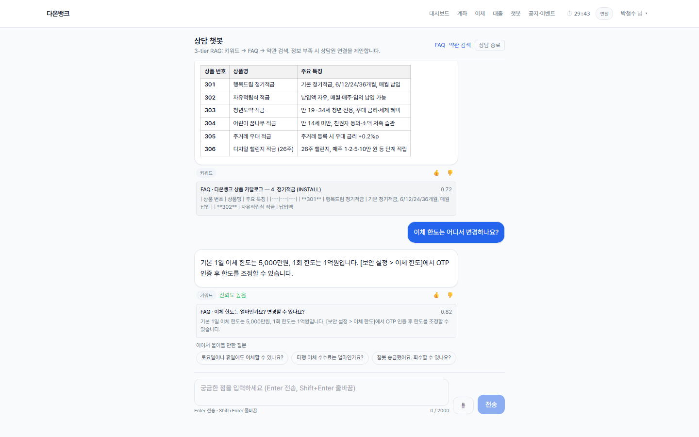
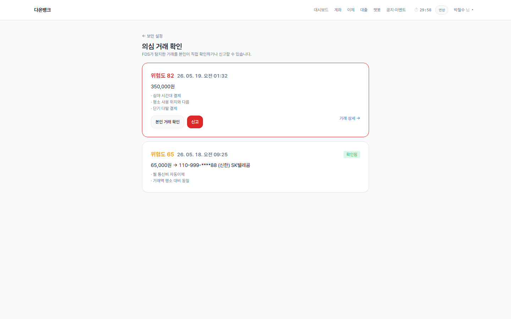
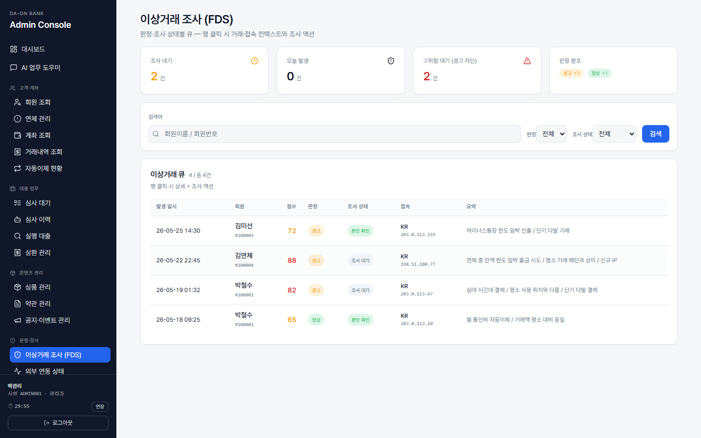
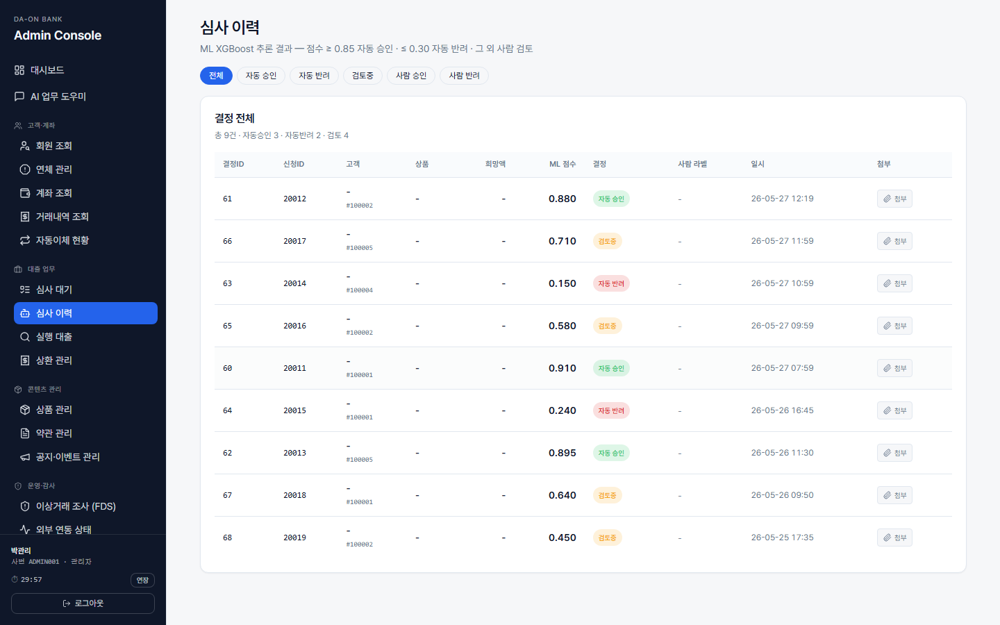

# 다온뱅크 (Da-On Bank)

은행 서비스에서 흔히 보는 화면들을 한 번씩 다 만들어 본 풀스택 포트폴리오입니다.
계좌 이체, 자동이체, 대출 신청, 적금 가입, 의심거래 신고, 사용자·직원용 챗봇(권한 분리), 직원이 쓰는 관리자 화면까지 한 묶음으로 돕니다.

기술 스택: FastAPI · Next.js 14 · PostgreSQL 16 · Kafka · Phoenix · XGBoost · scikit-learn · LLM(Groq/Mistral)

---


<table>
<tr>
<td width="50%">

<br /><sub>사용자 챗봇 — 약관·SOP 검색 후 답변, 출처 카드 노출</sub>
</td>
<td width="50%">

<br /><sub>의심거래 자동 탐지 — 룰 칩 + ML 이상도 + LLM 한국어 설명</sub>
</td>
</tr>
<tr>
<td width="50%">

<br /><sub>관리자 콘솔 — 이상거래 조사·판정 흐름</sub>
</td>
<td width="50%">

<br /><sub>대출 자동 심사 — 점수·6피처·승인/반려 근거</sub>
</td>
</tr>
</table>

---

## 이거 뭐 보여주려고 만든 거예요?

세 가지를 신경 써서 만들었습니다.

**1. 은행 업무 흐름을 제대로 따라가는 것**

이체 하나만 봐도 같은 은행 안에서 보내는 경우, 다른 은행으로 보내는 경우(금융결제원 경유),
1억 이상의 거액 송금(한국은행 거액결제망 경유) 이렇게 세 갈래로 갈리는데, 그걸 다 분기해서 처리합니다.
자동이체는 백그라운드에서 1분마다 도래분을 찾아 자동 실행되며, 같은 회차가 두 번 빠지지 않도록 잠금 키를 둡니다.
대출은 "한도 조회 → 신청 → 약정 → 실행 → 매달 상환" 이 끝까지 이어지고, 공동명의 통장이나
미성년 자녀 명의 통장은 누가 무슨 권한을 갖는지(조회·출금·이체·해지)까지 별도 테이블로 관리합니다.

**2. 챗봇·ML 이 단순 데모로 끝나지 않게 하는 것**

챗봇은 자주 묻는 질문이 먼저 매칭되도록 하고, 안 맞으면 키워드, 그래도 안 맞으면 본문 임베딩으로 찾아갑니다.
세 단계 다 신뢰도가 낮으면 솔직하게 "잘 모르겠다"고 답해 엉뚱한 말을 만들어내지 않도록 막았습니다.
대출 자동 승인은 XGBoost 로 0~1 점수를 매기는데, 0.85 이상은 자동 승인, 0.30 이하는 자동 거절,
**그 사이 회색지대는 사람 직원이 검토하는 큐로 떨어집니다.** 사람과 AI 가 협업하는 흐름을 직접 시연할 수 있습니다.

의심거래(FDS)도 단순 시드 카드가 아닙니다. 거래가 발생하면 Kafka 로 흘러가서 **룰 8개 + IsolationForest 이상 탐지 + LLM 자연어 설명**
이 한 파이프라인으로 돌아가고, 점수가 임계치를 넘으면 알림 카드가 자동으로 뜨면서 "왜 의심됐는지" 한국어로 설명까지 같이 노출됩니다.

**3. 동작이 보이게 만드는 것**

LLM 호출이 얼마나 걸렸는지, 어떤 답변을 어떤 자료를 보고 만들었는지, 토큰을 얼마나 썼는지를
Phoenix(Arize) UI 에서 바로 볼 수 있게 자동 추적을 붙였습니다. 관리자 화면의 모든 API 호출은
감사 로그 테이블에 자동 적재되고, 누가 언제 무엇을 조회했는지가 기록됩니다.

---

## 한 번 따라가 보고 싶으면 (3분 시연)

```
1) http://localhost:3001/login
   박철수(park@daon.example / demo1234)로 로그인
   → 대시보드, 보유 계좌 3개, 잔액 약 1,800만 원

2) 상품 카탈로그에서 "자유적립식 적금" 선택 → 약관 동의
   → 매달 10만 원 / 12개월 / 매월 15일 자동이체로 등록
   → 가입 완료 후 자동이체 목록에 새 항목이 들어가 있음

3) 즉시 이체 화면 → 받을 계좌 입력 → 예금주 자동 표시 → 100원 송금
   → 백그라운드에서 정산 메시지가 처리되어 거래 내역에 반영

4) 챗봇 화면에서 "드론 배달 통장 같은 거 있어요?" 라고 물어보기
   → 자료에 없는 질문이라 정중히 거절 + 6006 포트의 Phoenix UI 에 호출 흔적 남음

5) 의심거래 화면 → 자동 탐지된 알림 카드에서 LLM 한국어 설명 확인
   → "본인 거래 확인" 클릭 시 카드가 "확인됨" 으로 바뀌고 알림 목록에 반영
   → 카드에 발동된 룰 칩 4종 + ML 이상도 % 표시
─────────────────────────────────────────
6) http://localhost:5001/login   (관리자 콘솔)
   사번 ADMIN001 / 비번 admin1234
   → "대출 검토 큐" 에 김미선(점수 0.45) 신청 건 노출
   → 신청 상세에서 점수·특성 확인 → "승인" 또는 "거절" 확정
   → 감사 로그 화면에 방금 한 행동이 기록되어 있음

7) "AI 업무 도우미" 메뉴에서 "보이스피싱 신고 절차 알려줘" 물어보기
   → 내부 SOP 자료를 단계별(1·2·3)로 정리해서 답변
   → 사용자 챗봇(3001)에서 같은 질문을 하면 일반 안내만 나오고
     내부 SOP 는 절대 노출 안 됨 (audience RBAC)

8) http://localhost:6006   (Phoenix)
   조금 전 챗봇 호출의 추적 정보 — 토큰 사용량, 응답 시간 확인
```

---

## 실행

도커가 설치돼 있다는 전제로, 한 번에 다 띄울 수 있습니다.

```bash
# 1) 백엔드 묶음 (DB · API 서버 · 메시지 큐 · 관측 UI)
docker compose up -d --build

# 2) 일반 사용자 화면
cd frontend && npm install && npm run dev          # http://localhost:3001

# 3) 직원/관리자 화면
cd frontend-admin && npm install && npm run dev    # http://localhost:5001
```

| 접속처 | URL | 메모 |
|---|---|---|
| 사용자 화면 | http://localhost:3001 | 일반 고객용 |
| 관리자 화면 | http://localhost:5001 | 직원·심사용 |
| API 문서 | http://localhost:8001/docs | FastAPI 가 자동으로 만들어 주는 OpenAPI 문서 |
| Phoenix | http://localhost:6006 | 챗봇/LLM 호출 추적 화면 |
| 데이터베이스 | localhost:5434 | 계정: `bank / bank1234 / bank` |

### 시연용 계정

| 누구 | 이메일 또는 사번 | 비밀번호 | 어떤 시나리오? |
|---|---|---|---|
| 박철수 | `park@daon.example` | `demo1234` | 주거래 고객 — 계좌·대출·자동이체 다 있음 |
| 김영희 | `kim.yh@daon.example` | `demo1234` | 박철수 배우자 (공동명의 시연용) |
| 김연체 | `kim.over@daon.example` | `demo1234` | 30일 넘게 연체 중 (관리자 추적용) |
| 김미선 | `kim.ms@daon.example` | `demo1234` | 마이너스 통장 + 신용대출 (검토 큐에 잡힘) |
| 회귀용 | `test@example.com` | `testpass123!` | 회귀 검증 기본 계정               |
| 관리자 | `ADMIN001` (사번) | `admin1234` | 관리자 콘솔용                   |

---

## 어떻게 생긴 시스템인가요?

### 1. 컨테이너 6개 — 각자 무슨 일을 하는가

<p align="center">
  
</p>

| 컨테이너 | 포트 | 무슨 일을 하나 |
|---|---|---|
| **frontend** | 3001 | 사용자가 보는 화면 — 로그인·계좌·이체·대출·챗봇 등 30개 넘는 페이지 |
| **frontend-admin** | 5001 | 직원이 보는 콘솔 — 회원·계좌 조회, 대출 심사 큐, 연체 추적, 감사 로그 등 14 페이지 |
| **backend** | 8001 | 모든 비즈니스 로직이 도는 한 프로세스 — API + 백그라운드 작업 + ML 추론 + 챗봇이 한 곳 |
| **postgres** | 5434 | 일반 테이블 100개 + 벡터 검색용 확장(`pgvector`). 한 DB 안에서 거래·약관·임베딩까지 다 처리 |
| **kafka** | 9092 | 비동기로 처리할 작업을 잠시 쌓아두는 줄 — 이체 정산, 이상거래 평가, LLM 호출 기록 등 |
| **phoenix** | 6006 | LLM 호출을 한 화면에서 보는 도구 — 어떤 모델이 몇 토큰을, 몇 ms 만에, 어떤 프롬프트로 답했는지 |

`pgvector` 는 PostgreSQL 에 "768차원 벡터" 컬럼을 추가해 주는 확장이라, 챗봇이 질문을 벡터로 바꾼 뒤 약관 본문 벡터들과 코사인 거리로 비교하는 데 그대로 사용합니다. JWT 토큰은 로그인 후 발급되는 짧은 문자열 — 매 요청마다 다시 로그인할 필요 없이 누구인지·유효 기한이 토큰 자체에 서명되어 들어 있습니다.

---

### 2. backend 한 프로세스 안의 7가지 일

```
FastAPI 앱이 켜질 때 (lifespan 훅) 아래 7가지가 한꺼번에 기동됩니다.

① 미들웨어 2개 — 모든 요청이 거쳐가는 관문
   • RequestContextMiddleware
       → 요청마다 고유 ID(X-Request-ID) 부여 + 로그에 자동으로 따라붙음.
         장애 분석 시 "이 ID 로 검색하면 그 요청의 전 과정 로그가 모임".
   • AdminAuditMiddleware
       → /api/admin/* 응답이 끝나는 순간 ADMIN_AUDIT_LOG 테이블에 자동 기록.
         "누가, 언제, 어떤 API, 어떤 자원에, 결과는 OK/거부/오류" 까지.
         업무 코드에 한 줄도 안 넣어도 되고, 위조 토큰 시도까지 다 남음.

② 라우터 41개 (api/*.py)
   사용자용 22개 + 관리자용 19개, 모두 /api 아래로만 묶여 있음.
   (예외: 상태 확인용 / 와 /health 두 개만 prefix 없이 노출)

③ 서비스 레이어 — 실제 비즈니스 로직
   transfer / loan / fds_pipeline / chatbot / loan_decision /
   auto_transfer_worker / admin_audit / llm / chatbot_cache / ...

④ 백그라운드 워커 2개 — 누가 부르지 않아도 알아서 도는 작업
   • auto_transfer_worker.run()  → 1분마다 "이번 회차에 빠질 자동이체" 스캔·실행
   • admin_health.worker_loop()  → 60초마다 외부망 5종(KFTC·BOK·NICE·KCB·마이데이터) ping

⑤ Kafka 이벤트 수신자 6개 (start_consumer × 6)
   각 토픽에 메시지가 도착할 때마다 핸들러가 자동 실행 — §3 표 참고.

⑥ ML/RAG 부팅 (한 번만)
   • fds_anomaly.ensure_model()
       → 거래 약 1,000건으로 IsolationForest 학습 + .pkl 캐시 → 이후 추론 1ms
   • load_corpora(/app/data)
       → FAQ·약관·SOP 문서를 메모리에 올려두고 검색 준비

⑦ 관측 (Observability) 자동 연결
   • OpenTelemetry 자동 계측 활성화 → LLM 호출이 일어날 때마다
     "어떤 모델, 몇 토큰, 몇 ms, 어떤 프롬프트" 를 phoenix 컨테이너로 자동 전송.
```

"lifespan 훅" 은 FastAPI 앱이 켜지고 꺼질 때 한 번씩 실행되는 자리예요 — DB 연결 풀, 모델 로드, 워커 시작 같은 준비 작업을 여기에 모아 둡니다. "OpenTelemetry 자동 계측" 은 LLM 라이브러리에 패치가 걸려서 함수 호출이 일어날 때마다 trace 정보가 알아서 phoenix 로 빠지는 표준 방식이고, 비즈니스 코드에는 한 줄도 안 들어갑니다.

---

### 3. Kafka 토픽 7개 — 비동기 작업이 어디로 흘러가나

| 토픽 이름 | 누가 메시지를 보내나 | 누가 받아서 무엇을 하나 |
|---|---|---|
| `transfer.settlement.requested` | `service/transfer.py` — 타행 이체에서 출금이 끝난 직후 | `handle_settlement_requested` — 외부 결제망(KFTC) 호출을 흉내내고 성공이면 입금까지 마무리, 실패면 출금을 되돌려 균형 복구 |
| `transfer.settlement.completed` | settlement 처리 완료 후 | (감사·관측용. 지금은 받는 곳이 없음 — 알림·통계용으로 나중에 연결할 자리) |
| `transfer.account.verify.requested` | 사용자가 "타행 계좌" 입력하고 예금주 확인 누를 때 | `handle_external_bank_verify` — 외부 은행 응답을 시뮬한 뒤 reply 토픽으로 응답 |
| `transfer.account.verify.replies` | 위 시뮬 응답 | `handle_verify_reply` — DB 에 예금주 결과 저장 → 프론트가 이걸 폴링해서 화면에 표시 |
| `fds.transaction.detected` | TRANSACTION 한 건이 DB 에 들어간 직후 | `handle_fds_evaluation` — **룰 8개 + IsolationForest + LLM 한국어 설명** 을 한 파이프라인으로 돌려 의심거래 판정 |
| `chatbot.llm.calls` | `service/llm.py` — LLM 을 호출할 때마다 | `handle_llm_call_trace` — `AI_LLM_CALL_LOG` 테이블에 모델명·토큰·지연·프롬프트 전문 적재 |
| `chatbot.rag.evaluations` | 챗봇이 검색을 끝낸 직후 | `handle_rag_evaluation` — `AI_RAG_EVALUATION` 에 질문·검색 결과·Faithfulness 점수 적재 |

**Kafka 가 꺼져 있을 때는 어떻게 되나요?**
- 메시지를 보내는 쪽(producer)은 그냥 **조용히 건너뜁니다** — HTTP 응답은 막히지 않고 정상 동작.
- 받아서 처리해야 할 핸들러(예: 정산 처리, FDS 평가)는 **같은 backend 프로세스 안에서 비동기 작업으로 직접 실행**합니다. 즉 "큐를 거쳐 처리되던 일을 즉시 그 자리에서 처리" — 사용자는 차이를 못 느낍니다.
- 결과적으로 Kafka 가 살아 있든 죽어 있든 서비스는 끊기지 않습니다. (운영 환경에서는 Kafka 가 다시 살아나면 자동으로 큐 경로로 복귀)

---

### 4. 핵심 시나리오 4가지 — 어떤 코드가 어떻게 연결되어 도나

#### A. 이체 — 같은 은행·다른 은행·거액(1억+) 3갈래

```
[사용자가 이체 버튼 클릭]
   └─ POST /api/transfer   (frontend → backend)
       └─ api/transfer.py
          ├─ 같은 은행(INTRA): DB 한 작업 묶음에서 출금+입금을 한꺼번에
          │                   (둘 다 성공 or 둘 다 실패 — 절반만 빠지는 일 없음)
          ├─ 다른 은행(INTER): 출금만 즉시 처리 → settlement.requested 토픽으로 메시지
          └─ 거액(1억+): 위와 같지만 "거액 라우팅" 플래그 — 한국은행 망 시뮬 경로
              ↓ Kafka
    handle_settlement_requested 가 받아서:
      ├─ 외부 KFTC 호출 시뮬 → 성공이면 입금 반영 + settlement.completed 발행
      └─ 실패면 출금을 되돌리는 거래를 자동으로 한 건 더 적재 (잔액 복원)
              ↓ TRANSACTION INSERT
       fds.transaction.detected 가 자동 발행됨 → 아래 B 흐름으로 이어짐
```

> "출금만 됐는데 입금이 실패했을 때 출금을 되돌리는 방식" = Saga 패턴의 **보상 거래**. 분산 시스템에서 흔히 쓰는 안전망. / "같은 요청이 두 번 들어오면 한 번만 처리" = `IDEMPOTENCY_KEY` 컬럼에 UNIQUE 제약을 걸어 DB 단에서 차단.

#### B. 의심거래 분류 — 룰 + ML + LLM 한 파이프라인

```
TRANSACTION 1건 INSERT
   └─ Kafka 토픽: fds.transaction.detected
        └─ handle_fds_evaluation 가 받아서:
           ① fds_rules.evaluate()        → 8가지 규칙 점검, rule_score (0~145)
           ② fds_anomaly.score()         → IsolationForest 추론, ml_score (0~40)
           ③ total = rule×0.6 + ml×0.4   (0~127 범위)
           ④ 60 미만 : AI_FDS_DECISION 에만 기록 (감사용, 화면엔 노출 X)
           └─ 60 이상 : fds_llm_explain.generate()
                          → Groq Llama 가 한국어 3~4문장으로 "왜 의심인지" 설명
                          + FDS_DETECTION INSERT + 사용자 알림 생성
                          → 사용자 화면에 카드가 자동으로 등장
```

#### C. 대출 자동 심사 — XGBoost 점수 0~1 → 3갈래

```
[사용자] POST /api/loans/.../apply
   └─ api/loan.py → LOAN_APPLICATION 테이블에 신청 1건 적재
[관리자/시스템] POST /api/admin/loans/{id}/predict
   └─ api/admin_loan.py → loan_decision.predict_and_persist()
      ① extract_features()           → DB 에서 6개 피처 즉시 집계
                                       (신용점수·연체이력·예금잔액·연소득·신청비율 등)
      ② joblib.load("loan_xgb_v1.joblib").predict_proba()
                                       → 0~1 사이 점수
      ├─ 점수 ≥ 0.85 : AUTO_APPROVE (자동 승인)
      ├─ 점수 ≤ 0.30 : AUTO_REJECT (자동 거절)
      └─ 0.30~0.85   : HUMAN_REVIEW (회색지대 — 관리자 콘솔 "검토 큐"로 자동 등재)
                          └─ 직원이 화면에서 승인/반려 라벨링 → 결정 영구 적재
```

#### D. 챗봇 — 캐시 → 검색 → 필요 시 LLM, 단 환각 방지

```
[사용자/관리자] POST /api/chatbot/messages 또는 /api/admin/chatbot/messages
   └─ 라우터가 audience='USER' 인지 'ADMIN' 인지 자동 결정
      (사용자 토글 불가 — 토큰에서 자동 판별)
      └─ service/chatbot.chat_send()
         ① 캐시 확인 — chatbot_cache.get_cached(audience, 정규화된 질문)
            └─ HIT  : ~1ms 만에 그대로 응답 (임베딩·검색·LLM 모두 스킵)
         ② MISS면 3단계 검색 (Tier):
            ├─ Tier1 KEYWORD/FAQ (거리 ≤ 0.50): FAQ 답변 그대로, LLM 미사용
            ├─ Tier2 VECTOR     (거리 ≤ 0.70): 약관/SOP 발췌 → LLM 으로 합성
            │   └─ service/llm.py  → Groq → 실패 시 Mistral → 그래도 실패면 HF
            │       └─ Kafka 발행: chatbot.llm.calls         → AI_LLM_CALL_LOG
            │       └─ Kafka 발행: chatbot.rag.evaluations  → AI_RAG_EVALUATION
            │       └─ 자동 추적:  → phoenix (토큰·지연·프롬프트 전문)
            └─ 모두 초과: "확인되지 않습니다" 솔직히 거절 (환각 차단)

권한 분리 — 같은 코드, 검색 범위만 다름:
   USER  → AUDIENCE_CD IN ('USER','BOTH')           : 약관·상품·고객 화면 가이드
   ADMIN → AUDIENCE_CD IN ('USER','ADMIN','BOTH')   : 위 + KYC/AML/SOP/직원 가이드
   (직원 SOP 가 일반 고객에게 누출될 수 없음 — SQL WHERE 한 줄 차이)
```

> 챗봇 캐시(`chatbot_cache.py`)는 최근 호출 256건을 메모리에 두고 1시간 TTL — 같은 질문이 1초 안에 두 번 들어오면 두 번째는 LLM 을 아예 안 부르고 0.6초 → 0.001초로 끝납니다. 모든 호출은 캐시 hit 여부까지 `AI_LLM_CALL_LOG` 에 적혀 사후 재현 가능.

---

### 5. 전체 흐름 한눈에

```
사용자 요청 ──► RequestContextMiddleware (요청 ID 발급)
                       │
                       ▼
                  라우터 → 서비스
                       │
            ┌──────────┼─────────────┬──────────────┬─────────────┐
            ▼          ▼             ▼              ▼             ▼
        postgres   Kafka 토픽       ML 추론        LLM 호출      Phoenix
        (즉시 반영) (비동기 작업    (XGBoost /    (Groq/Mistral / (자동 추적
                    분리)         IsoForest)    HF 폴백)        남김)

관리자 요청 ──► AdminAuditMiddleware ──► ADMIN_AUDIT_LOG (응답 직후 자동 기록)
```

즉시 반영해야 할 일은 PostgreSQL 에 바로 쓰고, 외부 망 호출처럼 시간이 걸리거나 실패할 수 있는 일은 Kafka 로 떼어내 비동기로 돌립니다. AI 호출 흔적은 자동으로 Phoenix 에 trace 가 남고, 관리자 호출은 응답 직후 감사 로그 테이블에 자동 적재됩니다.

---

## 이체는 어떻게 처리되나요?

**같은 은행 안에서 보내는 이체**는 DB 한 작업 묶음 안에서 출금·입금을 한꺼번에 처리합니다. 둘 중 하나라도 실패하면 둘 다 취소 — 절반만 빠지는 일이 없습니다. (DB 트랜잭션의 ACID 보장)

**다른 은행으로 보내는 이체**는 출금만 즉시 끝내고, 입금 처리는 Kafka 라는 이벤트 큐에 "정산 처리 요청" 메시지로 떼어 놓습니다. 백그라운드에서 도는 작업자가 그 메시지를 받아 외부 결제망(KFTC) 호출을 흉내내고 입금까지 마무리합니다.

이때 입금 시뮬이 실패하면 **자동으로 출금을 되돌리는 거래를 한 건 더 적재**해서 잔액을 원상 복구합니다. 같은 요청이 두 번 들어오면 DB 컬럼의 UNIQUE 제약 덕분에 한 번만 처리됩니다. 만약 Kafka 가 꺼져 있으면 같은 처리 함수를 **같은 backend 프로세스 안에서 비동기 작업으로 즉시 실행** — 큐를 거치지 않고 그 자리에서 처리하므로 사용자는 차이를 못 느낍니다.

이 패턴이 흔히 말하는 Saga 보상 거래입니다 — 분산 환경에서 "출금/입금을 한 트랜잭션으로 묶기 어려우니, 중간이 깨지면 되돌리는 거래를 한 건 더 적재해 균형 맞추기".

결과적으로 사용자 체감은 항상 100ms 이내이고, 시스템은 외부 결제망의 장애로부터 격리됩니다. 한국 은행 실무에서 쓰는 이벤트 기반 분산 트랜잭션 모델을 그대로 따라간 구조입니다.

---

## 대출 자동 심사는 어떻게 분류하나요?

신청이 들어오면 우리 DB 에서 6개 피처를 즉시 집계해 XGBoost 모델에 넣고 **0~1 사이 점수**를 받습니다. 점수 구간에 따라 세 갈래로 자동 분류:

| 점수 | 결정 | 설명 |
|---|---|---|
| **≥ 0.85** | `AUTO_APPROVE` | 신용·소득 우량 → 즉시 승인 |
| **≤ 0.30** | `AUTO_REJECT` | 연체·소득 부족 → 즉시 거절 |
| **0.30 ~ 0.85** | `HUMAN_REVIEW` | 회색지대 → 관리자 검토 큐로 |

### 점수에 들어가는 6개 피처

| 피처 | 출처 | 의미 |
|---|---|---|
| `credit_score` | `CUST_GRADE_CD` + 연체이력·연봉 기반 룰 (300~950) | 신용점수 |
| `overdue_days_24m` | `LOAN_REPAY_HISTORY.OVERDUE_DAYS` 24개월 누적 | 누적 연체일수 |
| `overdue_ratio` | `OVERDUE` 회차 / 전체 회차 | 연체 비율 (0~1) |
| `deposit_balance` | `ACCOUNT.BALANCE` 양수 합계 | 보유 예금 |
| `annual_income` | `INDIVIDUAL_PARTY.ANNUAL_INCOME` | 연소득 |
| `request_ratio` | 신청금액 / (신용점수 × 10만) | 권장한도 대비 신청 비율 |

### 학습 데이터

**UCI German Credit (1,000행)** 의 신용 등급·저축·고용 정보를 한국 은행 피처로 매핑해 베이스로 쓰고, **합성 데이터 9,000행** 을 추가해 한국 시장 분포(연봉·예금 잔액 KRW 단위)에 맞춥니다. XGBoost 와 Logistic Regression 두 모델을 학습시켜 AUC 가 더 높은 XGBoost(`loan_xgb_v1.joblib`)를 운영에 사용. 모든 추론 결과는 `AI_LOAN_DECISION` 테이블에 영구 저장되어 감사·재현 가능합니다.

### 모델·임계값 운영 노트

- **학습 스크립트**: `backend/app/scripts/train_loan_model.py` — UCI German Credit + 합성 9,000행 → 8:2 stratified split.
- **XGBoost 파라미터**: `n_estimators=200, max_depth=5, learning_rate=0.1, eval_metric="logloss", random_state=42`.
- **Logistic Regression** 는 `class_weight="balanced"` + `StandardScaler` 파이프라인으로 비교용 학습 후 폐기.
- **임계값 결정 근거**: 0.85/0.30 은 시드+페르소나 9명 sanity set 에서 자동 승인 우량 비율 ≈ 35%, 자동 거절 ≈ 20%, 회색지대 ≈ 45% 가 되도록 조정. 회색지대를 일부러 넓게 잡아 사람 검토 데모 비중 확보.
- **추론 폴백**: `_load_model` 이 joblib 로드 실패하면 BusinessError(`E_INTERNAL_ERROR`) 로 즉시 알람 — 임의 점수로 자동 승인되는 사고 방지.
- **재추론 가드**: 같은 application 에 미검토 HUMAN_REVIEW row 가 있으면 재추론하지 않고 기존 row 를 그대로 반환(`meta.reused=True`) — 관리자 큐에서 점수가 흔들리지 않도록.

### 사람이 검토하는 회색지대 — 사람+AI 협업

자동 승인·거절은 빠르지만 모호한 신청을 무리하게 분류하지 않습니다. 점수가 0.30~0.85 구간이면 **관리자 콘솔의 "검토 큐" 로 자동 이관**되고, 직원이 ML 입력 피처 + 첨부서류 일치성을 함께 보면서 최종 승인·반려를 결정합니다. **"AI 가 자신 있을 때만 자동, 나머지는 사람"** 이라는 사람+AI 협업 모델을 그대로 구현했습니다.

---

## 의심거래는 어떻게 자동 분류되나요?

대출 점수 모델과는 다른 결을 가진 **하이브리드 분류기** 입니다 — **룰(전문가 지식)** · **ML(IsolationForest 이상 탐지)** · **LLM(자연어 설명)** 셋이 한 파이프라인을 이룹니다.

```
[고객 이체 발생] → TRANSACTION INSERT
       ↓ Kafka topic: fds.transaction.detected
       ↓
[Consumer: handle_fds_evaluation]
   ① 룰 평가 (8개)        → rule_score [0~145] + fired 리스트
   ② IsolationForest    → ml_anomaly [0~1] → ml_score = round(ml_anomaly × 40)
   ③ total_score = round(rule_score × 0.6 + ml_score)
   ④ total ≥ 60: LLM 자연어 설명 → FDS_DETECTION INSERT + 알림
      total < 60: AI_FDS_DECISION 만 적재(감사 추적)
```

### 판정 임계값 — `service/fds_pipeline.py:THRESHOLD`

총점은 0 ~ 약 127 범위. 60 이상이 알람·관리자 큐 진입 대상이고, 60 이상에서 다시 3 단계로 갈립니다.

| 총점 | judgment | 화면 표시 |
|---|---|---|
| **< 60** | (감사용 row 만 적재) | 카드 미노출 |
| **60 ~ 74** | `REVIEW` | "검토 필요" |
| **75 ~ 89** | `WARN` | "경고" |
| **≥ 90** | `ALARM` | "즉시 차단 권고" |

### 룰 8개 — 도메인 전문가 규칙

| 룰 코드 | 트리거 조건 | 점수 |
|---|---|---|
| `R_NIGHT` | 거래 시각 00~05시 | 15 |
| `R_AMOUNT_ZSCORE` | 본인 30일 평균 + 3σ 초과 | 25 |
| `R_NEW_COUNTERPART` | 90일 거래 없던 신규 수취인 | 15 |
| `R_BURST` | 10분 안 동일 계좌 출금 3건 이상 | 20 |
| `R_FOREIGN_IP` | 해외 IP (ACCESS_COUNTRY ≠ KR) | 25 |
| `R_DAILY_LIMIT_NEAR` | 일일 누적 ≥ DAILY_WITHDRAW_LIMIT × 0.9 | 10 |
| `R_NEW_DEVICE` | `CUSTOMER_DEVICE` 미등록 디바이스 | 20 |
| `R_LARGE_INTERBANK` | 타행 + 1천만원 이상 | 15 |

### ML 모델 — IsolationForest (sklearn)

라벨 없이 정상 거래 분포만으로 학습하는 unsupervised anomaly detection. 부팅 시점에 `service/fds_anomaly.py:ensure_model()` 이 시드+검증 누적 거래 1,000건으로 fit → `/app/data/fds_isoforest.pkl` 캐시 → 추론은 1ms.

**파라미터**: `IsolationForest(contamination=0.10, n_estimators=100, random_state=42)` — 정상 90% 가정, 트리 100개. 학습 row 가 30건 미만이면 학습 스킵하고 추론 시 중립값 0.5 반환(폴백).

**7개 피처** (`_FEATURE_ORDER`):

| 피처 | 의미 |
|---|---|
| `log_amount` | log(거래 금액) — 큰 금액 비선형 정규화 |
| `hour_of_day` | 시각 (0~23) |
| `day_of_week` | 요일 (0~6) |
| `is_interbank` | 타행 여부 (0/1) |
| `counterpart_freq` | 본인이 지난 90일간 이 상대 계좌로 보낸 횟수 |
| `amount_zscore_personal` | 본인 30일 평균 대비 z-score |
| `daily_cum_amount_log` | log(오늘 누적 출금액) |

raw `decision_function` 결과(약 -0.5 ~ +0.5) 를 `[0, 1]` 로 정규화 — 1에 가까울수록 이상. 그 후 `× 40` 으로 ml_score 환산 (룰 60% + ML 40% 가중치 의도).

### LLM — 자연어 설명 생성

룰·ML 점수를 그대로 보여주면 "왜?" 가 이해가 안 됩니다. `service/fds_llm_explain.py` 가 거래 컨텍스트(고객명·평소 평균·이번 금액·탐지된 사유 한국어 설명·ML 이상도)를 Groq Llama 3.1 에 보내 **한국어 3~4문장** 으로 정리합니다. 룰 코드(`R_NIGHT` 같은 내부 식별자)는 LLM 에 아예 전달하지 않고 시스템 프롬프트로도 "내부 용어·코드 노출 금지"를 명시해, 모델이 입력을 베껴 사용자에게 흘리는 사고를 차단합니다.

> "박철수 고객님, 평소 새벽에는 거래가 없으셨는데 이번 출금이 심야 시간대에 발생했습니다. 짧은 시간 안에 같은 계좌로 여러 건이 연달아 빠져나갔고, 평소 사용하지 않으시던 해외 접속·새 기기로 보였습니다. 본인 거래가 아니라면 즉시 신고 버튼으로 알려주세요."

LLM 호출이 실패해도 룰 한국어 설명을 슬래시로 결합한 fallback (`"심야 시간대 거래 / 평소보다 큰 금액 …"`) 으로 서비스 끊김 없음.

### 어디에 영구화?

`AI_FDS_DECISION` 테이블에 룰·ML·LLM 점수 근거를 영구 저장. `FDS_DETECTION` 과 1:1 매핑 + `LLM_CALL_ID` 컬럼이 `AI_LLM_CALL_LOG` 와 링크되어 Phoenix trace 까지 추적 가능. 감사·재현·재학습 데이터 베이스로 그대로 사용 가능.

---

## 챗봇은 어떻게 답변하나요?

사용자 질문이 들어오면 한국어 임베딩 모델(**`jhgan/ko-sroberta-multitask`**)로 768차원 벡터로 변환한 뒤, pgvector 의 `<=>` 코사인 거리로 사전에 임베딩된 FAQ·약관·SOP 코퍼스와 비교해 **신뢰도에 따라 3단계로 분기**합니다. 답변 못 만들면 솔직하게 "확인되지 않습니다" 라고 거절 — **환각(hallucination) 방지가 최우선**입니다.

| Tier | 매칭 조건 | 처리 방식 | confidence |
|---|---|---|---|
| **1. KEYWORD** | FAQ 거리 ≤ 0.30 | FAQ 답변 그대로 반환 (LLM 미호출) | HIGH |
| **2. FAQ** | FAQ 거리 ≤ 0.50 | FAQ 답변 그대로 반환 (LLM 미호출) | MEDIUM |
| **3. VECTOR** | 약관 거리 ≤ 0.70 | 약관 본문 발췌 → **LLM 으로 답변 합성** + 출처 표시 | MEDIUM / LOW |
| **거절** | 모두 초과 | "관련 정보를 찾지 못했습니다" 솔직 안내 | LOW |

### 환각 방지 — 3단계 안전망

1. **거리 임계값 게이팅**: 약관 거리가 0.85 초과면 LLM 호출 자체를 안 함
2. **시스템 프롬프트 강제**: "**아래 약관/규정 발췌만을 근거로** 답변하세요. 발췌에 없는 내용은 추측하지 말고 '약관에서 확인되지 않습니다' 라고 답하세요"
3. **출처 표시**: VECTOR Tier 답변은 항상 참조한 약관 청크(출처)를 사용자에게 함께 노출 — 클릭하면 원문 확인 가능

### 사용자 챗봇 ↔ 관리자 챗봇 — 한 endpoint, RBAC 로 분리

같은 `service/chatbot.py` 가 사용자 화면(3001)과 관리자 콘솔(5001) 양쪽을 처리합니다. 다른 점은 **호출 측이 누구냐(`audience`) 만** — 라우터에서 자동 결정되고 사용자가 토글할 수 없습니다.

| 항목 | 사용자 챗봇 (3001) | 관리자 챗봇 — "AI 업무 도우미" (5001) |
|---|---|---|
| endpoint | `/api/chatbot/*` | `/api/admin/chatbot/*` |
| JWT 권한 | 일반 고객 | 직원(ADMIN/AUDIT) 만 |
| 검색 대상 | `AI_FAQ.AUDIENCE_CD IN ('USER','BOTH')` | `('USER','ADMIN','BOTH')` (직원은 고객 FAQ 도 본다) |
| 답변 톤 | 고객 상담체 (3문장 이내, 친근) | SOP 매뉴얼체 (단계별·법령 인용·6문장 이내) |
| 노출 자료 | 약관·상품 안내·고객 화면 가이드 | + KYC·AML·VOICE_PHISHING·SYSTEM_OPS·관리자 화면 SOP |
| 세션 식별 | `CUSTOMER_NO` (고객 본인) | `EMPLOYEE_NO → pseudo 990000+` 매핑 (`AI_CHATBOT_SESSION` 동일 테이블, FK 완화) |

직원 SOP·내부 보안 문서가 일반 고객에게 절대 노출되지 않도록 **단일 endpoint + audience 분기 (B 방식)** 로 RBAC 을 구현. AI_FAQ.AUDIENCE_CD 컬럼에 인덱스를 걸어 SQL 한 줄(`WHERE "AUDIENCE_CD" = ANY($2::text[])`)로 권한 분리됩니다.

### RAG 코퍼스 구성

| 출처 | 청크 수 | AUDIENCE_CD | 용도 |
|---|---|---|---|
| 상품 약관·정관 25종 | ~3,500 | USER | 적금/예금/대출/외화 등 가입 조건·해지·이자 계산 |
| 페르소나 FAQ 시드 | ~120 | USER / BOTH | "내 한도 어디서 봐요?" 같은 화면 안내 |
| `data/admin-sop/synthetic/13-user-screen-guide.md` | ~70 | **BOTH** | 30개 사용자 화면 메뉴 경로 안내 |
| `data/admin-sop/synthetic/14-admin-screen-guide.md` | ~60 | **ADMIN** | 18개 관리자 콘솔 화면 안내 |
| 내부 SOP 합성 9종 (KYC/AML/COMPLAINT/VOICE_PHISHING…) | ~150 | ADMIN | 직원용 업무 절차 |
| AI Hub 금융 학술 코퍼스 | ~8,235 | USER | 도메인 백업 — 합성 SOP 가 못 찾을 때 폴백 |

합성 SOP 청크에는 `SOURCE_TAG='SYNTH_SOP'` 라벨을 달고 검색 거리에 `-0.15` 보너스를 줘서, AI Hub 학술 청크보다 우선 매칭되도록 가중치 조정했습니다.

### LLM 호출은 외부 API 멀티 폴백

`Groq Llama 3.1-8B-Instant` 를 1순위로 쓰고, 키 없으면 자동으로 `Mistral` → `HuggingFace` 순으로 fallback. 어느 키도 없으면 LLM 합성을 스킵하고 약관 발췌만 그대로 보여줍니다 (서비스 절대 안 끊김).

### 답변 렌더링 — react-markdown + remark-gfm

LLM 이 단계별·표·코드블록을 markdown 으로 반환하므로 양쪽 화면 모두 `react-markdown` + `remark-gfm` 으로 렌더합니다. 사용자 화면은 친근한 본문 위주, 관리자 화면은 표·번호 리스트·법령 인용 anchor 가 그대로 살아납니다. 출처 카드의 미리보기는 `stripMarkdown` 으로 평문 변환해 노이즈 제거.

### 답변 캐싱 — 같은 질문은 LLM 다시 안 부른다

`service/chatbot_cache.py` 가 최근 256건 메모리 캐시 + 1시간 만료(TTL)로 운영됩니다. 캐시 키는 `(audience, 정규화된 질문)` — USER/ADMIN 권한이 다르면 같은 문장이라도 따로 캐싱. 같은 질문이 1초 안에 두 번 들어오면 두 번째는 임베딩·검색·LLM 모두 건너뛰고 **약 1ms 만에 즉시 응답** (실측: 1812ms → 1ms, 99.9% 단축).

캐시가 효과적인 이유는 시연·운영 모두 같은 질문 반복 빈도가 높기 때문 — "한도 어디서 봐요?", "보이스피싱 절차" 같은 자주 묻는 항목. 매번 LLM 호출 비용을 안 들이고도 응답 품질은 동일하게 유지됩니다.

### 모든 호출은 자동 추적 — 사후 재현 가능

LLM 을 호출할 때마다 다음이 자동으로 영구 기록됩니다:

- **Kafka 토픽 2개로 비동기 적재**
  - `chatbot.llm.calls` → `AI_LLM_CALL_LOG` 테이블 — 모델명·토큰 수·지연·**system 프롬프트 전문·user 프롬프트 전문·retrieved context 청크·response 전문·cache hit 여부** 모두 잘리지 않고 저장 (`db/26_llm_call_log_prompt_trace.sql`).
  - `chatbot.rag.evaluations` → `AI_RAG_EVALUATION` 테이블 — 검색 결과 + Faithfulness/Answer-Relevance/Context-Precision/Context-Recall 4가지 RAG 품질 메트릭.
- **자동 추적 도구(OpenTelemetry)** — 코드 변경 없이 호출 흔적이 Phoenix 컨테이너로 실시간 전송.

**관리자 콘솔에는 두 가지 보는 길**이 있습니다:
1. **자체 화면 `/observability`** — `AI_LLM_CALL_LOG` 를 KPI 5종(24시간 누적·캐시 hit·miss·hit률·평균 LLM 지연) + 필터(USER/ADMIN, hit/miss, 질문 검색) + 행 클릭 펼침으로 system 프롬프트·user 프롬프트·검색된 context 청크·응답 전문을 한 자리에서 확인.
2. **Phoenix UI iframe 임베드** — 같은 화면 아래쪽에 외부 도구 그대로. trace 타임라인·토큰 누적·지연 분포 등.

"왜 이 답변이 나왔는지" 어떤 시점이든 사후 재현 가능 — 캐시 hit 시점에도 같은 프롬프트가 그대로 남아 있어 추적성이 끊기지 않습니다.

---

## 관리자 콘솔은 어떻게 동작하나요?

고객용 화면(`frontend`, 포트 3001)과 **완전히 분리된 별도 Next.js 프로젝트(`frontend-admin`, 포트 5001)** 입니다. 백엔드도 라우터 prefix 를 `/api/admin/*` 로 격리하고 직원 계정 인증을 별도로 운영합니다 — 일반 고객 JWT 로는 절대 진입 못 합니다.

### 1. 인증 — 직원 계정 전용

```
EMPLOYEE_MASTER (직원 마스터)
   └─ EMPLOYEE_NO + bcrypt 해시 비번 + AUTH_LEVEL_CD (ADMIN / AUDIT)
        ↓ 로그인
ADMIN_SESSION (세션 이력)
   └─ SESSION_ID, LOGIN_DATETIME, LAST_ACTIVITY_DT, SESSION_STATUS_CD
        ↓ JWT 발급 (role=ADMIN, employee_no, session_id 클레임)
require_admin Depends 가드
   - JWT 디코드 검증
   - ADMIN_SESSION.STATUS=ACTIVE 확인
   - LAST_ACTIVITY_DT + INQUIRY_COUNT 자동 갱신
```

권한 등급:
- **`ADMIN`** (박관리, ADMIN001) — 전권 (대출 승인·반려, 회원 조회)
- **`AUDIT`** (김감사, AUDIT001) — 감사 — 조회만 가능

### 2. 모든 호출 자동 감사 — `AdminAuditMiddleware`

`/api/admin/*` 로 들어오는 **모든 요청은 응답 후 `ADMIN_AUDIT_LOG` 테이블에 자동 INSERT** 됩니다 (사용자 코드 한 줄도 추가 안 필요).

| 컬럼 | 내용 |
|---|---|
| EMPLOYEE_NO | 누가 (미인증이면 `UNKNOWN`) |
| ACTION_CD | 무엇을 (`LOAN_PREDICT`, `OVERDUE_DETAIL` 등 매핑) |
| TARGET_TABLE / TARGET_ID | 어떤 자원에 (`LOAN_APPLICATION:20002`) |
| RESULT_CD | OK / DENIED / ERROR |
| ACCESS_IP / USER_AGENT | 접속 경로 |
| REQUEST_PAYLOAD | 민감 키 자동 마스킹된 본문 |
| TIMESTAMP | 언제 |

**미인증 호출도 적재** — 위조 토큰·만료 세션 시도까지 감사 흔적 남깁니다.

### 3. 10 화면 — 사람+AI 협업 콘솔

| 화면 | 핵심 동작 |
|---|---|
| **대시보드** | 검토 대기 / 자동 승인 / 연체 회원 / 외부망 정상 / Phoenix 카운터 한 화면 |
| **대출 검토 큐** | ML 점수 0.30~0.85 회색지대 신청 목록 (HUMAN_REVIEW) |
| **AI 의사결정 이력** | 전체 추론 결과 + 자동 승인·거절·검토 분포 |
| **신청 상세** | 6개 ML 입력 피처 + 점수 + 사람 라벨링(승인/반려/메모) |
| **첨부서류 일치성** | 요구 서류(`DOC_REQUIREMENT`) vs 제출(`ATTACHED_DOC`) 매트릭스 — 누락·미검증 빨강 |
| **연체 추적** | `LOAN_REPAY_HISTORY.OVERDUE` 회차 집계 + 회원별 상세 + 가산금리 |
| **외부망 헬스** | KFTC / BOK-Wire / 마이데이터 / NICE / KCB 5종 — 워커가 60초마다 ping → `EXTERNAL_API_HEALTH` 적재 |
| **AI 업무 도우미** | 직원용 챗봇 (RBAC 분리) — KYC·AML·내부 SOP 검색, 대화 이력 검색·근거 전문 modal, 👍/👎 + 이슈 카테고리 |
| **AI 호출 추적** | `/observability` — 자체 화면(KPI 5종 + 필터 + 행 클릭 시 system/user 프롬프트·context·응답 전문 펼침) + 아래에 Phoenix UI iframe |
| **감사 로그** | `ADMIN_AUDIT_LOG` 조회 — 누가 언제 무엇을 했는지 시계열 |

---

## 어떤 화면들이 있나요?

| 영역 | 화면 수 | 핵심 내용 |
|---|---|---|
| 로그인 / 가입 / 보안 | 12 | 비밀번호 / 간편 비밀번호 / 일회용 비밀번호 / 생체 / 디바이스 등록 / 세션 자동 갱신 |
| 계좌 | 8 | 잔액 / 거래 내역 / 계좌 설정 / 한도 변경(7일 점검 기간 적용) |
| 이체 | 8 | 즉시 이체 / 자동이체 / 1회 예약 / 자주 쓰는 계좌 |
| 대출 | 9 | 한도 조회 → 신청 → 약정 → 실행 → 매달 상환 |
| 상품 가입 | 11 | 카탈로그 / 약관 / 입출금·정기예금·적금·외화·공동명의·미성년 |
| 챗봇 | 5 | 자주 묻는 질문 + 키워드 + 임베딩 단계 응답 / 출처 보기 / 좋아요·싫어요 |
| 의심거래 | 2 | 자동 분류기(룰+ML+LLM) 알림 + 본인 확인·신고 |
| 자산분석 | 4 | 설문 → 분석 → 결과 → 맞춤 상품 추천 |
| 공지 / 이벤트 | 4 | 게시판 (비로그인 공개) |
| **관리자 콘솔** | 10 | 대시보드 / 검토 큐 / AI 의사결정 이력 / 신청 상세 / 첨부서류 일치성 / 연체 추적 / 외부망 상태 / **AI 업무 도우미(직원 챗봇)** / Phoenix 임베드 / 감사 로그 |

---

## 기술 스택

| 분야 | 사용 기술 | 한 줄 설명 |
|---|---|---|
| 프런트엔드 | **Next.js 14** (App Router) | React 기반 웹 프레임워크 |
| | **React 18** · **TypeScript** | 화면 라이브러리 + 정적 타입 |
| | **Tailwind CSS** · **shadcn/ui** | 스타일링 + 재사용 UI 컴포넌트 |
| | **react-markdown** · **remark-gfm** | 챗봇 답변(LLM markdown) 렌더 — 표·번호 리스트·코드블록 그대로 |
| 백엔드 | **FastAPI** | 파이썬 비동기 웹 프레임워크 |
| | **asyncpg** | PostgreSQL 비동기 드라이버 |
| | **Pydantic** | 요청·응답 검증 |
| | **PyJWT** · **bcrypt** · **pyotp** | 토큰 인증 / 비밀번호 해시 / 일회용 비밀번호 |
| 데이터베이스 | **PostgreSQL 16** | 관계형 DB, JSON 컬럼 활용 |
| | 100+ 테이블 | 거래 주체를 PARTY 공통 테이블로 묶고 개인·법인 정보를 분리한 표준 패턴 |
| AI / LLM | **Groq Llama 3.1** · Mistral · HuggingFace | 응답 생성 LLM (키 없으면 자동 전환) |
| | **jhgan/ko-sroberta-multitask** | 한국어 문장 임베딩 모델 |
| 머신러닝 | **XGBoost** | 대출 자동 승인 점수 모델 |
| | **scikit-learn IsolationForest** | 의심거래 이상 탐지(unsupervised) |
| | UCI German Credit + 합성 데이터 | 학습 데이터셋 |
| 관측 | **Arize Phoenix** + **OpenTelemetry** | LLM 호출 자동 추적·시각화 |
| | **structlog** | JSON 구조화 로그 |
| | 관리자 감사 로그 | 미들웨어에서 자동 적재 |
| 메시지 큐 | **Apache Kafka 3.7** (KRaft) | 이체 정산·자동이체·LLM 호출 로그 |
| 인프라 | **Docker Compose** | 5개 컨테이너 묶음 실행 |
| 검증 | **Playwright** · **pytest** | 브라우저 자동화 + 백엔드 테스트 |

---

## 폴더 구조

```
bank-portfolio/
├── backend/                # FastAPI 서버
│   └── app/
│       ├── api/            # HTTP 라우터 (도메인별)
│       ├── service/        # 비즈니스 로직, 백그라운드 워커
│       ├── schema/         # 요청/응답 모델
│       ├── middleware/     # 요청 ID, 감사 로그, 개인정보 마스킹
│       ├── scripts/        # ML 학습 스크립트
│       └── main.py         # 진입점
├── frontend/               # 일반 사용자 화면 (3001 포트)
├── frontend-admin/         # 관리자 화면 (5001 포트)
├── data/
│   ├── corpus/                # 약관·정관·FAQ 마크다운 (사용자용 RAG)
│   └── admin-sop/synthetic/   # 직원용 합성 SOP — KYC·AML·VOICE_PHISHING·SYSTEM_OPS·화면 안내 등
├── db/
│   ├── 01_schema.sql                       # 라이브 DB 에서 추출한 스키마
│   ├── 02_seed.sql                         # 상품 25종 + 약관 + 매핑
│   ├── 05_persona_seed.sql                 # 페르소나 5명 풀 세트
│   ├── 06_notice_event.sql                 # 공지·이벤트 게시판
│   ├── 09_fds_alert_seed.sql               # 의심거래 시드
│   ├── 11_admin_auth_migration.sql         # 관리자 직원 계정
│   ├── 12_seed_999999_party.sql            # 회귀 계정 보강
│   ├── 13_doc_seed.sql                     # 대출 첨부서류
│   ├── 14_human_review_seed.sql            # 검토 큐 시연 시드
│   ├── 18_fds_decision.sql                 # 의심거래 자동 분류기 결과(룰·ML·LLM)
│   ├── 21_ai_faq_audience.sql              # AI_FAQ.AUDIENCE_CD 컬럼 (USER/ADMIN/BOTH)
│   ├── 22_ai_chatbot_admin_session.sql     # 관리자 챗봇 pseudo customer_no FK 완화
│   └── 23_ai_faq_source_tag.sql            # 합성 SOP 청크 가중치 라벨
└── docker-compose.yml      # 5개 서비스 + DB 초기 시드 자동 마운트
```

---

## 데이터베이스 스키마 갱신

라이브 DB 가 정답입니다. 스키마를 바꾼 다음에는 다시 뽑아 둡니다.

```bash
docker exec bank-portfolio-postgres \
  pg_dump -U bank -d bank --schema-only --no-owner --no-privileges \
  > db/01_schema.sql
```

---

## 검증

도메인별로 풀체인 e2e 가 돌아가는 것을 확인해 두었습니다.

- 상품 5종 가입(보통예금·정기예금·외화·공동명의·미성년) — 브라우저 자동화로 끝까지
- 이체 3갈래 — 같은 은행 안 / 타행 / 거액
- 자동이체 워커 — 1회·매월·매주 일정 + 같은 회차 중복 실행 방지
- 의심거래 — 거래 발생 → 자동 평가(룰+ML+LLM) → 카드 자동 등장 → 본인 확인/신고 후 알림 발행
- 관리자 인증·감사 — 세션 만료 / 잘못된 토큰 거부 / 모든 호출 자동 기록
- 챗봇 — 단계별 응답 분기 + Phoenix 에 추적 정보 적재

---

## 만들면서 막혔던 것들

**챗봇 코퍼스 범위를 너무 좁게 잡았다.** 처음엔 "고객이 물어볼 건 어차피 상품 안내·약관이지" 하고 가볍게 보고 약관만 학습시켰습니다. 막상 시연 질문을 돌려보니 "보이스피싱 신고 어떻게 해요?", "한도 어디서 봐요?" 같은 약관 바깥의 질문이 훨씬 많이 나왔어요. 결국 은행 업무 방침·민원 처리 SOP·화면 가이드까지 합성해서 코퍼스를 8천 청크 넘게 넓혔는데, 그래도 Faithfulness 가 기대만큼 안 나옵니다. **얼마나 더 학습시켜야 적정선인지** 가 지금 가장 큰 고민이에요. 청크를 늘리면 검색 잡음도 같이 늘어나서, 단순히 데이터를 더 부어 넣는 게 답이 아닌 것 같다는 생각.

**Phoenix 가 본인한테는 너무 어려웠다.** 수업에서 배운 걸 그대로 붙여서 trace 는 잘 쌓이는데, 정작 "이 답변이 좋은지 나쁜지"를 보려고 하면 trace URI 따라 들어가서 한 건씩 펼쳐서 답변끼리 비교해야 하는 흐름이 직관적이지 않더라고요. 결국 관리자 콘솔에 `/observability` 화면을 따로 만들어서, KPI(24시간 누적·캐시 hit률·평균 LLM 지연) + 질문 검색 + 행 클릭으로 system/user 프롬프트·검색 context·응답 전문을 한 자리에서 펼치도록 구성했습니다. Phoenix 는 그 화면 아래 iframe 으로 두긴 했지만, 일상 점검은 자체 화면이 훨씬 빨라요. 이 과정에서 자연스럽게 "같은 질문 두 번째는 LLM 안 부르기" 캐시도 같이 붙였습니다 (1812ms → 1ms).

**자동화에 대한 호기심으로 시작했는데 막상 만들면서 가장 시간을 쓴 건 "안 끊기게 만드는 일" 이었다.** 외부 결제망 시뮬·Kafka·LLM API — 세 군데가 다 실패할 수 있어서, 각각 폴백을 안 만들면 시연 도중에 한 군데만 죽어도 다 같이 멈춥니다. Kafka 죽었을 때 같은 처리 함수를 비동기 작업으로 같은 프로세스 안에서 그대로 돌리는 패턴, LLM 키 없으면 약관 발췌만이라도 보여주는 패턴, 외부망 호출 실패 시 출금을 자동으로 되돌리는 거래 한 건 더 적재하는 패턴 — 화려하지는 않은데 시연 중 끊겼을 때 대처할 수 있게 만드는 게 의외로 큰 학습이었습니다.

---

> 로컬에서 시연을 재현하기 전 환경 점검과 단계별 의도는 [docs/DEMO_PREP.md](docs/DEMO_PREP.md) 를 참고하세요.